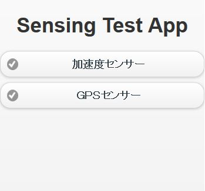
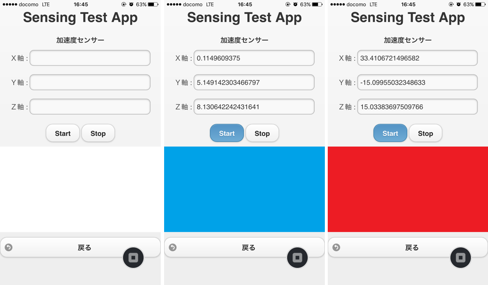
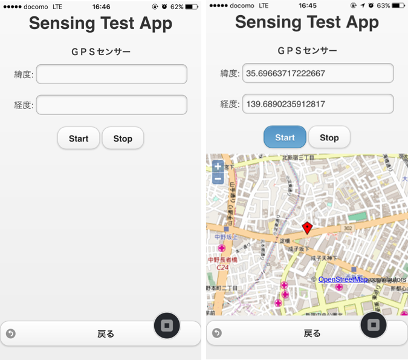

# 【IoT入門】スマホで加速度と位置情報を取得してクラウドに保存しよう！！

### ★加速度センサー

### ★ＧＰＳセンサー

## 概要
### マイコンとかセンサとかよく分からなくても楽しめるIoTを目指して・・・
最近ニフティクラウドmobile backendのハンズオンでIoTを扱うことが増えており、マイコン(Raspberry piやEdison)の使用したハンズオン検討していましたが難易度が高すぎ、初心者の方がついてこれなさそうで困っていました。
「マイコンやGPIOの配線などなど、電子工作と縁遠い人でもIoTを身近に感じ楽しめる内容を・・・」と考えたところ、多くの人が持っているスマホの「センサ」の値をクラウドに保存するコンテンツがよいのではないかと思いつき、今回のコンテンツを作りました。
内容をなるべく簡単にするため「HTML5」と「JavaScript」でスマホアプリの開発ができる「Monaca」を利用し「Andoridユーザー」でも「iPhoneユーザー」でも楽しめる内容としました。

## 事前準備
* [ニフティクラウドmobile backend](http://mb.cloud.nifty.com/?utm_source=community&utm_medium=referral&utm_campaign=sample_monaca_login_template)の準備
 * 利用登録
 * アプリの新規作成

* [Monaca](https://ja.monaca.io/) の準備
 * 利用登録
 * Monacaデバッガーのインストール
 * サンプルプロジェクトのインポート
　　※このページの「Download ZIP」を右クリックし、URLをコピー→Monacaで新規プロジェクトを作成時にインポートしてください。

 
 * [ニフティクラウドmobile backend](http://mb.cloud.nifty.com/?utm_source=community&utm_medium=referral&utm_campaign=sample_monaca_login_template)で新しいアプリを作成、APIキーの確認

 * 本ページ｢Download ZIP｣ボタンを右クリックしてサンプルプロジェクトURLをコピー→ [Monaca](https://ja.monaca.io/)にインポートし、プロジェクトを新規作成する。

## 作成手順
準備が整ったら、Monacaでプロジェクトを編集していきます。

### ・Cordvaプラグインを有効化する [実装済み]
* DeviceMotion : 加速度センサーを利用するためのプラグイン
* Geolocation : GPSセンサーを利用するためのプラグイン
* Splashscreen : スプラッシュスクリーンを利用するためのプラグイン

---------------------------------------
### ・ JavaScriptSDKの追加
 「設定」を選択→「JS/CSSコンポーネントの追加と削除…」を選択→検索欄に「NCMB」と入力して「検索」を押す→「追加」を押す

---------------------------------------
### ・js/app.js の編集
★(1)～(11)に次のコードを書いてください。
#### (1) APIキーの設定
mBaaSのコントロールパネルからアプリケーションキーとクライアントキーをコピーして貼り付けてください。

        var YOUR_APP_KEY = "ここにあなたのアプリケーションキーを入力してください";
        var YOUR_CLIENT_KEY = "ここにあなたのクライアントキーを入力してください";

#### (2) mBaaSの初期化

        ncmb = new NCMB(YOUR_APP_KEY,YOUR_CLIENT_KEY);

#### *Startボタン押下時の処理*
#### (3) 加速度センサーから値（x, y, z 軸方向に動く値）を取得する
        var watchId = navigator.accelerometer.watchAcceleration(onAcceSuccess, onAcceError, acceOptions);

#### (4) GPSセンサーから値（緯度経度）を取得する
        navigator.geolocation.getCurrentPosition(onGeoSuccess, onGeoError, geoOption);
        
#### *Stopボタン押下時の処理【加速度センサーの値を保存する】*
#### (5) データストアに保存用クラスを作成

        var AcceData = ncmb.DataStore("AcceData");

#### (6) クラスのインスタンスを生成
 
        var acceData = new AcceData();

#### (7) データの保存

         acceData.set("accelerometer", acce)  
                .save();

#### *Stopボタン押下時の処理【ＧＰＳセンサーの値を保存する】*
#### (8) データストアに保存用クラスを作成

        var GpsData = ncmb.DataStore("GpsData");

#### (9) クラスのインスタンスを生成
 
        var gpsData = new GpsData();

#### (10) 位置情報オブジェクトを作成

        var geoPoint = new ncmb.GeoPoint(); // (0,0)で生成
        geoPoint.latitude = lat;
        geoPoint.longitude = lng;

#### (11)  データの保存

        gpsData.set("geoPoint", geoPoint) 
               .save();
---------------------------------------
#### *コールバックとオプション メソッド* ［実装済み］

#### ・加速度センサーから値の取得に成功した場合のコールバック
        function onAcceSuccess(acceleration) {
            if(acce_flag){
                document.acce_js.x.value=acceleration.x;
                document.acce_js.y.value=acceleration.y;
                document.acce_js.z.value=acceleration.z;
                
                // センサーの値の変化を色で明示的に表示する
                if(Math.abs(acceleration.x)>20 || Math.abs(acceleration.y)>20 || Math.abs(acceleration.z)>20){
                    document.getElementById("color").src="js/img/red.png";//赤
                }else if(Math.abs(acceleration.x)>13 || Math.abs(acceleration.y)>13 || Math.abs(acceleration.z)>13){
                    document.getElementById("color").src="js/img/yellow.png";//黄
                }else{
                    document.getElementById("color").src="js/img/blue.png";//青
                }
                
                var acce = [acceleration.x,acceleration.y,acceleration.z];
                acce_array.push(acce);
            }
        };

#### ・加速度センサーから値の取得に失敗した場合のコールバック
        function onAcceError() {
            console.log('onAcceError!');
        };

#### ・加速度センサーから値をする時に設定するオプション
        var acceOptions = {
            // 取得する間隔を１秒に設定
            frequency: 1000
        }; 

#### ・ＧＰＳセンサーから位置情報の取得に成功した場合のコールバック
        var onGeoSuccess = function(position){
            if(gps_flag){
                current = new CurrentPoint();
                //検索範囲の半径を保持する
                current.distance = CurrentPoint.distance;
                //位置情報(座標)を保存する
                current.geopoint = position.coords;
                $(".map").empty();
                writemap(current.geopoint.latitude,current.geopoint.longitude);
                document.gps_js.lat.value=current.geopoint.latitude;
                document.gps_js.lng.value=current.geopoint.longitude;
            }
        };

#### ・ＧＰＳセンサーから位置情報の取得に失敗した場合のコールバック
        var onGeoError = function(error){
            console.log("現在位置を取得できませんでした");
        };

#### ・ＧＰＳセンサーから位置情報をする時に設定するオプション
        var geoOption = {
            // 取得する間隔を１秒に設定
            frequency: 1000,
            // 6秒以内に取得できない場合はonGeoErrorコールバックに渡すよう設定
            timeout: 6000
        };

#### ・位置情報を保持するクラスを作成
        function CurrentPoint(){
            // 端末の位置情報を保持する
            geopoint=null;
            // 位置情報検索に利用するための検索距離を指定する
           distance=0;
        }

####　・位置情報を地図(OpenStreetMap)に表示する
        function writemap(lat,lon) {
            // 現在地の地図を表示
            map = new OpenLayers.Map("canvas");
            var mapnik = new OpenLayers.Layer.OSM();
            map.addLayer(mapnik);
            console.log(lat+":"+lon);
            var lonLat = new OpenLayers.LonLat(lon, lat)
                                       .transform(
                                           new OpenLayers.Projection("EPSG:4326"), 
                                           new OpenLayers.Projection("EPSG:900913")
                                        );
            map.setCenter(lonLat, 15);
    
            // 現在地にマーカーを立てる
            var markers = new OpenLayers.Layer.Markers("Markers");
            map.addLayer(markers);
    
            var marker = new OpenLayers.Marker(
                new OpenLayers.LonLat(lon, lat)
                              .transform(
                                  new OpenLayers.Projection("EPSG:4326"), 
                                  new OpenLayers.Projection("EPSG:900913")
                )
            );
            markers.addMarker(marker);
        }
---------------------------------------
### ・動作確認
* Monacaデバッガーを使って動作確してください。
* Startボタンを押すと
 * 加速度センサー：x,y,z軸の値を取得し画面に表示します。また、画面に表示された色によって、加速度の変化が簡単に読み取れるようになっています。振ってみてください。
 * ＧＰＳセンサー：緯度経度の値を取得し画面に表示します。またOpenStreetMapを使用して、地図に表示しています。
* Stopボタンを押すと
 * 加速度センサー：１秒ごとに取得した値（x,y,z軸の値の配列が秒ごとの配列として）がmBaaSに保存されます。
 * ＧＰＳセンサー：値が位置情報（緯度経度の値のペア）としてmBaaSに保存されます。

* mBaaSのダッシュボードより、｢データストア｣を選択すると、新たに｢AcceData｣,「GpsData」クラスが作られています。各クラスを選択すると保存されたデータを確認することができます。

